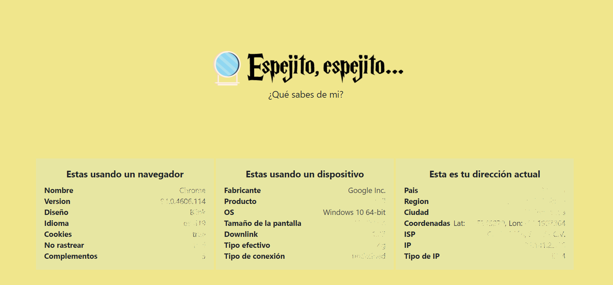

<h1 align="center">🍀 Espejito... My Data 🍀</h1>

  Small application that displays the data that a web page can obtain
  

> This project was made for learning purposes only

# How to use
## Step 1⃣
* Access to the website.
## Finish
* View your data, if you are using VPN it will show another address, if you are using Brave or another browser it may block tracking.

# Download
Available for Mac, Linux and Windows.

[Check the latest release](https://github.com/alexa-00/espejito)

# License
💜 [MIT License](/LICENSE)
